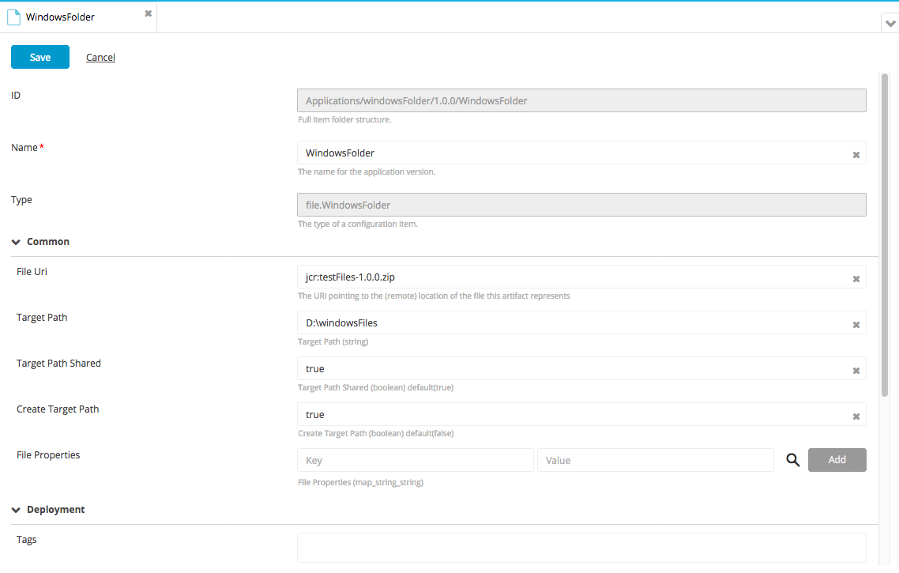
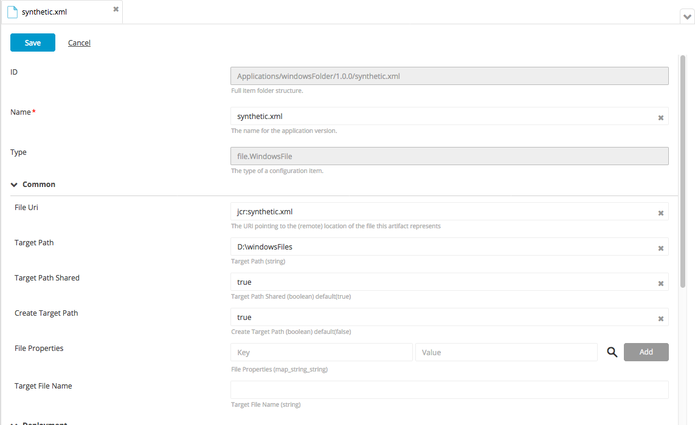

# XL Deploy Windows File plugin

[![Build Status][xld-windows-file-plugin-travis-image]][xld-windows-file-plugin-travis-url]
[![Codacy Badge][xld-windows-file-plugin-codacy-image] ][xld-windows-file-plugin-codacy-url]
[![License: MIT][xld-windows-file-plugin-license-image] ][xld-windows-file-plugin-license-url]
[![Github All Releases][xld-windows-file-plugin-downloads-image] ]()

[xld-windows-file-plugin-travis-image]: https://travis-ci.org/xebialabs-community/xld-windows-file-plugin.svg?branch=master
[xld-windows-file-plugin-travis-url]: https://travis-ci.org/xebialabs-community/xld-windows-file-plugin
[xld-windows-file-plugin-codacy-image]: https://api.codacy.com/project/badge/Grade/cbe6e057aa2f447c9d6e4a3092f192ad
[xld-windows-file-plugin-codacy-url]: https://www.codacy.com/app/joris-dewinne/xld-windows-file-plugin
[xld-windows-file-plugin-code-climate-image]: https://codeclimate.com/github/xebialabs-community/xld-windows-file-plugin/badges/gpa.svg
[xld-windows-file-plugin-license-image]: https://img.shields.io/badge/License-MIT-yellow.svg
[xld-windows-file-plugin-license-url]: https://opensource.org/licenses/MIT
[xld-windows-file-plugin-downloads-image]: https://img.shields.io/github/downloads/xebialabs-community/xld-windows-file-plugin/total.svg

# Overview

The Windows file plugin allows you to manage files and folders copied on Windows systems

# Requirements 

* **XL Deploy requirements**
	* **XL Deploy**: version 7.x

# Installation 

Place the plugin JAR file into your `SERVER_HOME/plugins` directory. 

# Features 

The Windows file plugin provides most of the same features as the Unix File plugin for Windows.  Some of the useful features are as follows:

* Shared sub-folders (i.e. sub folders are not deleted if they still contain objects)
* Conditional updates of files based on check sums
* Ability to set addributes on files

# Examples

There are two basic types that this plugin supports as follows:
* File.WindowsFolder
* File.WindowsFile

When copying new artifacts to the target it is possible to set properties (attributes) of the file by defining the attribute names and values in the **File Properties** box.  This is the same as executing the powershell command as follows:

`$(Get-Item <filename> ).<property key>=<property value>`

The list of potential file properties are as follows:

| Property          | Example Value          |
|-------------------|------------------------|
| Mode              | -a--- (darhs)          |
| IsReadOnly        | False                  |
| CreationTime      | 8/17/2009 9:28:43 AM   |
| CreationTimeUtc   | 8/17/2009 1:28:43 PM   |
| LastAccessTime    | 8/22/2009 6:13:01 PM   |
| LastAccessTimeUtc | 8/22/2009 10:13:01 PM  |
| LastWriteTime     | 12/17/2010 5:08:38 PM  |
| LastWriteTimeUtc  | 12/17/2010 10:08:38 PM |
| Attributes        | Archive                |

The list of potential file modes are as follows:

|    |   Mode    |
|----|-----------|
| d  | Directory |
| a  | Archive   |
| r  | Read-only |
| h  | Hidden    |
| s  | System    |

The list of potential file attributes are as follows:

| Attribute         |
| ----------------- |
| ReadOnly          |
| Hidden            |
| System            |
| Directory         |
| Archive           |
| Device            |
| Normal            |
| Temporary         |
| SparseFile        |
| ReparsePoint      |
| Compressed        |
| Offline           |
| NotContentIndexed |
| Encrypted         |

## File.WindowsFolder Example

## File.WindowsFile Example

## References
* [Use a PowerShell Cmdlet to Work with File Attributes](http://blogs.technet.com/b/heyscriptingguy/archive/2011/01/26/use-a-powershell-cmdlet-to-work-with-file-attributes.aspx)
* [File Attributes in PowerShell](https://mcpmag.com/articles/2012/03/20/powershell-dir-command-tricks.aspx)
* [What are the possible Mode values returned by Powershell's Get-ChildItem cmdlet?](http://stackoverflow.com/questions/4939802/what-are-the-possible-mode-values-returned-by-powershells-get-childitem-cmdlet)
