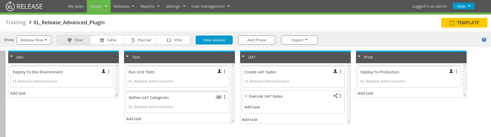

# XL Release Advanced Plugin

## Problem Statement
Acme Corporation has a release process that includes four phases ([Template](templates/XL_Release_Advanced_Plugin.groovy)):
- Dev
- Test
- UAT
- Prod

As you can see from the template, there is a user input task at the end of the Test phase called "Define UAT Categories". In this task, a list of the UAT categories to be performed on this application would be input. For example:
- Alpha Testing
- Beta Testing
- Contract Acceptance Testing
- Regulation Acceptance Testing
- Operational Acceptance Testing
- Black Box Testing

Next, there is a single manual task at the beginning the UAT phase called "Create UAT Gates". The purpose of this manual task is to have the assigned user look at the list of UAT categories that was input in the "Define UAT Categories" task. For each category in the list the user would manually create a corresponding gate task inside the "Execute UAT Gates" parallel group.

In this exercise, create a plugin with a custom task that replaces the "Create UAT Gates" manual task and does the following:
- Takes the list provided from the user input task "Define UAT Categories" in the Test phase and dynamically create a gate task for each UAT category that was in the list.
- Each gate tasks should run in parallel within the parallel group "Execute UAT Gates" that was already defined in the UAT phase of the provided template.
- Assigns each dynamically created gate task to the admin user.
