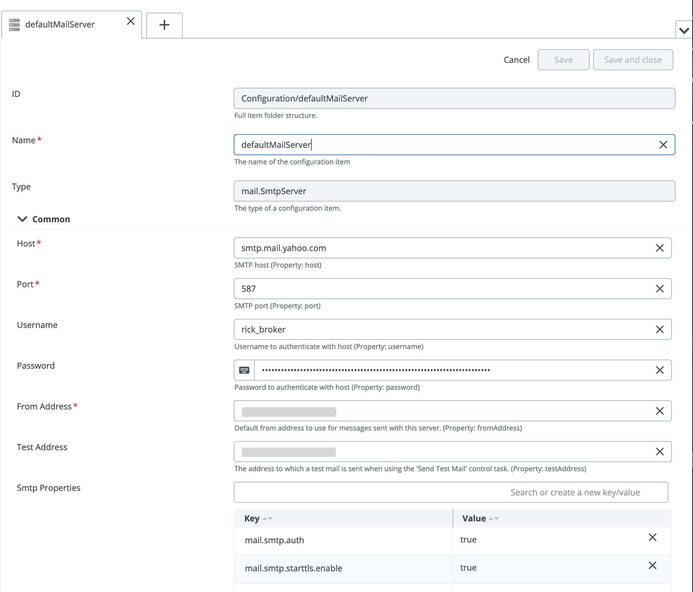

# Well Formatted E-Mail Notifications In XL Deploy

As a part of your XL Deploy automation strategy, you might want to have XL Deploy send out emails during some state changes of the deployment process.  XL Deploy uses FreeMarker templates to format and deliver emails when triggered in the deployment process.  XL Deploy can provide emails to various groups in your organization.  The emails sent out can be customized to different audiences in your organization as well.  In this article I will show you how to configure XL Deploy to send out emails during the deployment process.
For each deployment we want to collect some additional information that we are going to put in these emails.  To do that we need to make some changes to the synthetic.xml file as follows:

```
 <type-modification type="udm.Environment">
   <property name="requiresReleaseNotes" kind="boolean" required="false" category="Deployment Checklist"
             description="Release notes are required" />
   <property name="requiresPerformanceTested" kind="boolean" required="false" category="Deployment Checklist"
             description="Performance testing is required" />
   <property name="requiresBusinessSignoff" kind="boolean" required="false" category="Deployment Checklist"
             description="Business owner authorizing deployment is required" />
   <property name="requiresChangeTicket"     kind="boolean" required="false" category="Deployment Checklist"
             description="A change ticket (chg.ChangeTicket) mapped to a change management server is required as part of the deployment"/>
   <property name="requiresChangeTicketQA"   kind="boolean" required="false" category="Deployment Checklist"
             description="A change ticket (chg.ChangeTicket) mapped to a change management server is required as part of the deployment"/>
   <property name="requiresChangeTicketPROD" kind="boolean" required="false" category="Deployment Checklist"
             description="A change ticket (chg.ChangeTicket) mapped to a change management server is required as part of the deployment"/>
   <property name="requiresChangeTicketNumber"     kind="boolean" required="false" category="Deployment Checklist"
             description="A change ticket (chg.ChangeTicket) mapped to a change management server is required as part of the deployment"/>
 </type-modification>

 <type-modification type="udm.Version">
   <property name="satisfiesReleaseNotes" kind="boolean" required="false" category="Deployment Checklist" label="Does the package contain release notes?"
             description="Indicates the package contains release notes" />
   <property name="satisfiesPerformanceTested" kind="boolean" required="false" category="Deployment Checklist" label="Have performance tests been performed?"
             description="Indicates the package has been performance tested" />
   <property name="satisfiesBusinessSignoff" kind="string" required="false" category="Deployment Checklist" label="Enter the name or ID of the approving business owner"
             description="Indicates the business owner or manager authorizing deployment to production" />
   <property name="satisfiesChangeTicket"       kind="string" required="false" category="Deployment Checklist" label="Enter MASTER CC Number"
             description="Master Change #" />
   <property name="satisfiesChangeTicketQA"     kind="string" required="false" category="Deployment Checklist" label="Enter QA CC Number"
             description="QA Change #"     />
   <property name="satisfiesChangeTicketPROD"   kind="string" required="false" category="Deployment Checklist" label="Enter PROD CC Number"
             description="PROD Change #"   />
   <property name="satisfiesChangeTicketNumber" kind="string" required="false" category="Deployment Checklist" label="Enter MASTER CC Number"
             description="Master Change #" />
 </type-modification>
```

We can also use some of this information to determine if a deployment can continue in its’ pipeline.  Once the changes are made to the synthetic.xml file, restart the XL Deploy server.
We will need to tell XL Deploy where there is an SMTP server that emails can be set to.  In my environment (linux) I can create my own SMTP server and configure it as follows:


